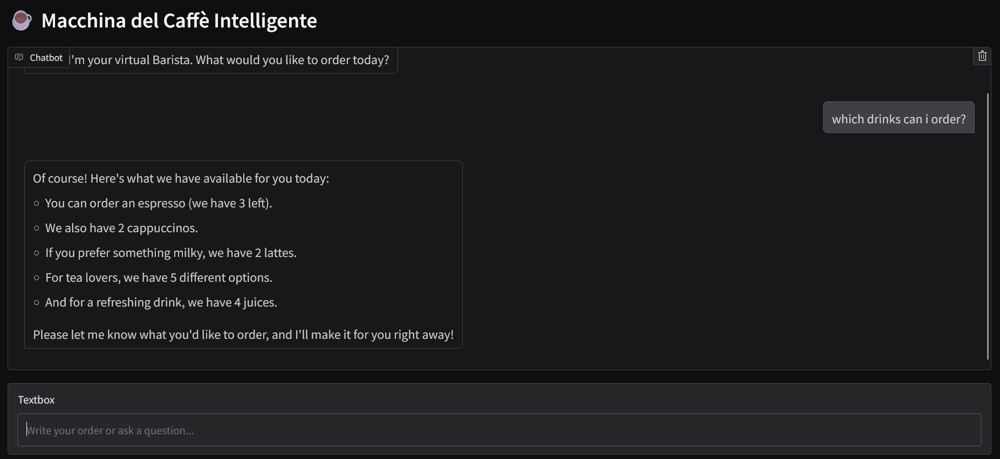
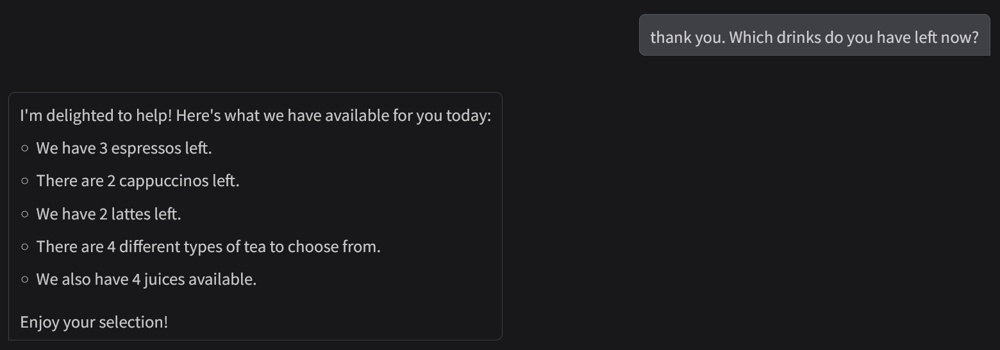

# ☕ AI Coffee Machine

An AI-powered virtual barista that takes coffee orders in natural language, manages inventory, and chats with you in a friendly way.
Built with Python, LangGraph, and an Mistral LLM.
It works from the command line, with a Gradio web interface, and even supports voice interaction 🎤

## 🚀 Features

- 🗣️ Natural language understanding → “I’d like a cappuccino without sugar”
- ✅ Two main actions:
**make_drink** → prepare a coffee. 
**list_drinks** → show available drinks
- 📦 Inventory management via inventory.json
- 🤖 Conversational barista personality
- 🖥️ Gradio UI with text & voice input
- 🎤 Voice mode (speak to the barista and get spoken replies)

## 📦 Requirements
- Python 3.9+ 
- langgraph
- pydantic
- gradio
- pyttsx3 (for voice output)
- speechrecognition (to record voice from microphone)

## LangGraph nodes structure
```
START
  ↓
interpret
  ├── if action == "list_drinks" → list_drinks → serve → LLM reply → END  
  └── else → check_inventory  
             ├── if inventory_ok == False → serve → LLM reply → END  
             └── if inventory_ok == True → brew → update DB → serve → LLM reply → END  
```


## 🖼️ Demo
### List of drinks


### Make an order


### Update DB

This project uses SQLite as a lightweight database for:
- tracking user memory like preferences or last orders, (but still to implement)
- storing coffee orders history
- optionally extending inventory management
